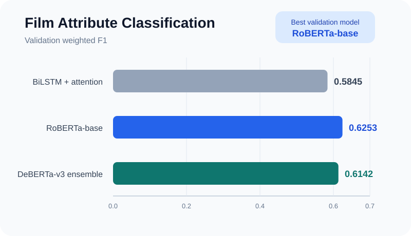

# Multi-label Film Attribute Classification

[English](README.md) | [한국어](README.ko.md) | [Portfolio home](../../README.md)

## Overview

This project assigns any combination of eight attributes to a film title and plot synopsis:

`comedy`, `cult`, `flashback`, `historical`, `revenge`, `romantic`, `scifi`, `violence`.

The work compares a recurrent baseline with two pretrained transformer pipelines while addressing label imbalance, long inputs, GPU constraints, and label-specific decision boundaries.

## Model comparison

| Model | Main techniques | Validation weighted F1 |
| --- | --- | ---: |
| [BiLSTM + attention](notebooks/bilstm-attention.ipynb) | GloVe embeddings, custom attention, Asymmetric Loss | 0.5845 |
| [RoBERTa-base](notebooks/roberta.ipynb) | Fine-tuning, mixed precision, layer-wise learning-rate decay | **0.6253** |
| [DeBERTa-v3 ensemble](notebooks/deberta-ensemble.ipynb) | Masked mean pooling, three training seeds, soft voting | 0.6142 |

The strongest individual DeBERTa-v3 seed reached 0.6223; the table reports the final ensemble score. On this dataset, RoBERTa-base delivered the best validation result despite the more elaborate DeBERTa pipeline.



## Engineering decisions

### Class imbalance

All models use Asymmetric Loss to reduce the contribution of easy negative examples and retain learning pressure on difficult positive labels. Rather than using one global 0.5 cutoff, each pipeline searches the validation predictions for an independent threshold per label.

### Long text and pooling

- The BiLSTM pipeline uses up to 1,400 tokens with 300-dimensional GloVe embeddings.
- RoBERTa and DeBERTa use a 512-token limit.
- The DeBERTa classifier mean-pools valid token states with an attention mask instead of relying on one classification token.

### Compute constraints

- Automatic mixed precision reduces GPU memory pressure during transformer training.
- Layer-wise learning-rate decay preserves lower-level pretrained representations in the RoBERTa pipeline.
- The DeBERTa pipeline trains seeds 16, 42, and 378 independently and averages their probabilities at inference time.

## Data

| Split | Rows | Labels available |
| --- | ---: | --- |
| Train | 7,127 | Yes |
| Validation | 1,031 | Yes |
| Test | 1,053 | No |

Each record contains an ID, title, and plot synopsis. The labelled splits include eight binary target columns in the order shown above.

## Project structure

```text
film-attribute-classification/
├── assets/        # Portfolio visualizations
├── data/          # Train, validation, and test CSV files
├── notebooks/     # BiLSTM, RoBERTa, and DeBERTa pipelines
├── results/       # Final test predictions for all three models
├── README.md
├── README.ko.md
└── requirements.txt
```

## Running the notebooks

Use Python 3.10 or 3.11. From this project directory:

```bash
python -m venv .venv

# Activate one environment:
# Windows PowerShell: .venv\Scripts\Activate.ps1
# macOS/Linux:        source .venv/bin/activate

python -m pip install --upgrade pip
python -m pip install -r requirements.txt
python -m nltk.downloader punkt punkt_tab stopwords wordnet omw-1.4
python -m jupyter lab
```

Open the selected notebook and run its cells in order. The notebooks read `data/train.csv`, `data/validation.csv`, and `data/test.csv`. The BiLSTM notebook downloads GloVe embeddings; the transformer notebooks download pretrained Hugging Face models.

A CUDA-capable GPU is strongly recommended for transformer training. When using CUDA, install the PyTorch wheel appropriate for the local CUDA version before installing `requirements.txt`; the remaining command will reuse that installation. Hardware, PyTorch, and CUDA differences can still introduce small numerical variation even with fixed seeds.

Checkpoints, downloaded weights, experiment trackers, raw logs, and intermediate validation predictions are intentionally excluded from Git. Clean reference predictions are retained in [`results/`](results/).

## Takeaway

The model comparison shows that additional architectural complexity did not guarantee a better result. RoBERTa-base provided the strongest validation score, while the DeBERTa ensemble offered a useful study in seed variance and probability ensembling. The most consistent improvement across all architectures came from treating loss design and decision-threshold calibration as first-class parts of the multi-label pipeline.
