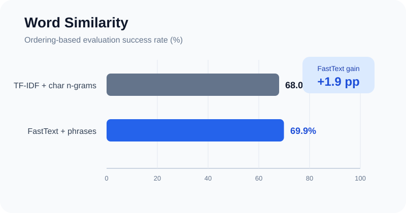

# Word Similarity with Sparse and Dense Representations

[English](README.md) | [한국어](README.ko.md) | [Portfolio home](../../README.md)

## Overview

This project estimates the semantic similarity of word and phrase pairs from representations learned on WikiText-103. It compares a sparse hybrid model with a dense embedding model, with particular attention to out-of-vocabulary terms, multi-word expressions, memory use, and inference cost.

## Approaches and results

| Approach | Representation | OOV strategy | Reported evaluation success rate |
| --- | --- | --- | ---: |
| [TF-IDF + character n-grams](notebooks/tfidf-character-ngrams.ipynb) | Word unigrams plus 3–5 character-boundary n-grams | Character-based morphological fallback | 68.0% |
| [FastText + phrase detection](notebooks/fasttext-phrases.ipynb) | 150-dimensional skip-gram embeddings with learned bigrams | FastText subword vectors | **69.9%** |

The reported success rate comes from the ordering-based example evaluator included in the original work. It should not be interpreted as a general benchmark accuracy.



## Engineering decisions

### Sparse hybrid model

- Limits the word vocabulary to 50,000 features and the character vocabulary to 30,000 features.
- Concatenates contextual word features with spelling-sensitive character features before cosine similarity.
- Averages constituent vectors for multi-word terms.
- Caches known, unknown, multi-word, and final vectors to avoid repeated sparse transformations.

### Dense FastText model

- Detects frequent bigrams with `min_count=5` and `threshold=10` before training.
- Trains 150-dimensional skip-gram vectors with a context window of 5 for five epochs.
- Uses subword information to produce vectors for terms that were not observed as complete tokens.
- Uses available CPU workers for parallel training.

## Project structure

```text
word-similarity/
├── assets/        # Portfolio visualizations
├── data/          # Example, gold-standard, and test word pairs
├── notebooks/     # Portfolio-ready source notebooks
├── results/       # Final prediction CSV files
├── README.md
├── README.ko.md
└── requirements.txt
```

## Running the notebooks

Use Python 3.10 or 3.11. From this project directory:

```bash
python -m venv .venv

# Activate one environment:
# Windows PowerShell: .venv\Scripts\Activate.ps1
# macOS/Linux:        source .venv/bin/activate

python -m pip install --upgrade pip
python -m pip install -r requirements.txt
python -m nltk.downloader punkt punkt_tab stopwords wordnet omw-1.4
python -m jupyter lab
```

Open the desired notebook and run its cells in order. The notebooks expect:

- Python with `pandas`, `numpy`, `scikit-learn`, `scipy`, `nltk`, and `gensim` for the FastText model;
- a WikiText-103 text file at `data/WikiText-103.txt`;
- the included `example-pairs.csv`, `example-pairs-gold.csv`, and `test-pairs.csv` files under `data/`.

The WikiText corpus, generated predictions, caches, and experimental artifacts are intentionally ignored by Git. The committed notebooks have no execution output; the reference result files are available in [`results/`](results/). CPU execution is supported, but training time depends heavily on corpus size and worker count.

## Limitations

- The sparse model relies heavily on corpus co-occurrence and spelling similarity, so related terms with little shared context may be underestimated.
- The dense model improves semantic coverage at the cost of longer training and higher memory use.
- Results depend on corpus preprocessing, library versions, and the exact WikiText-103 snapshot.
